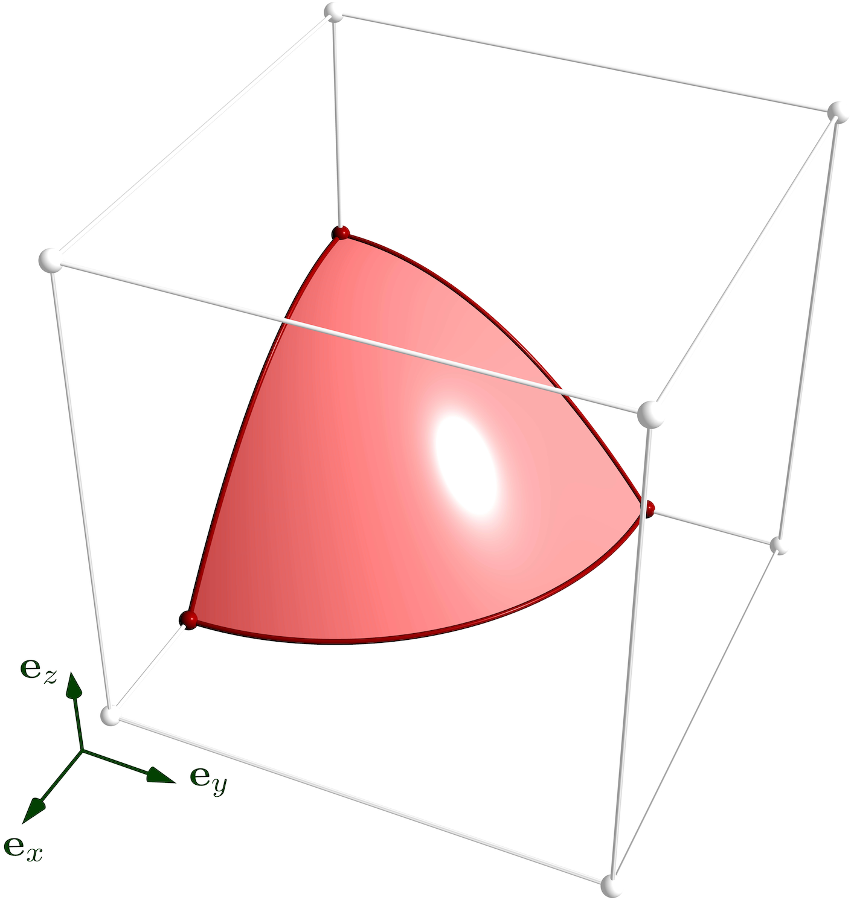
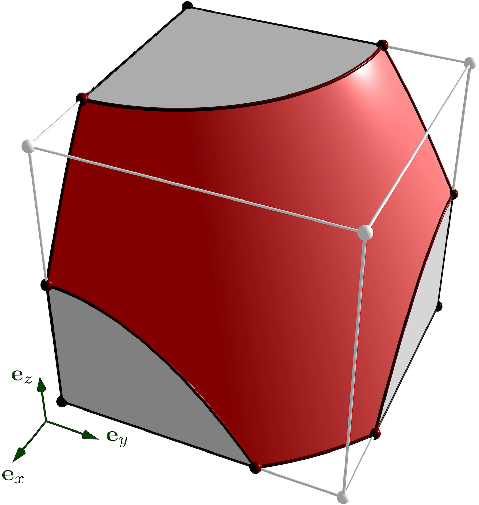
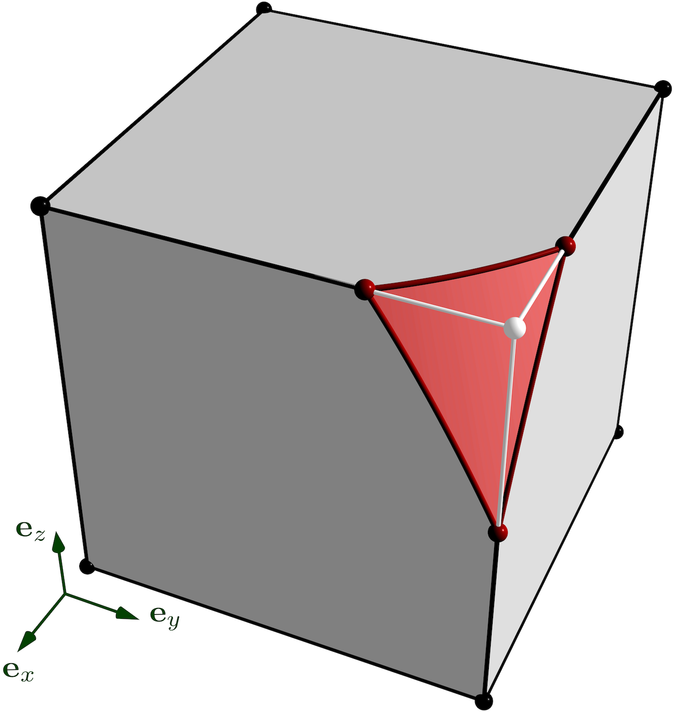
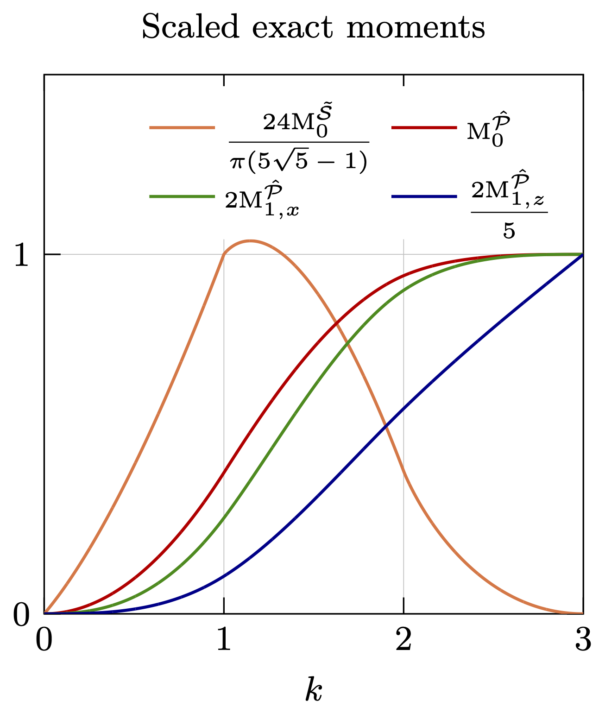
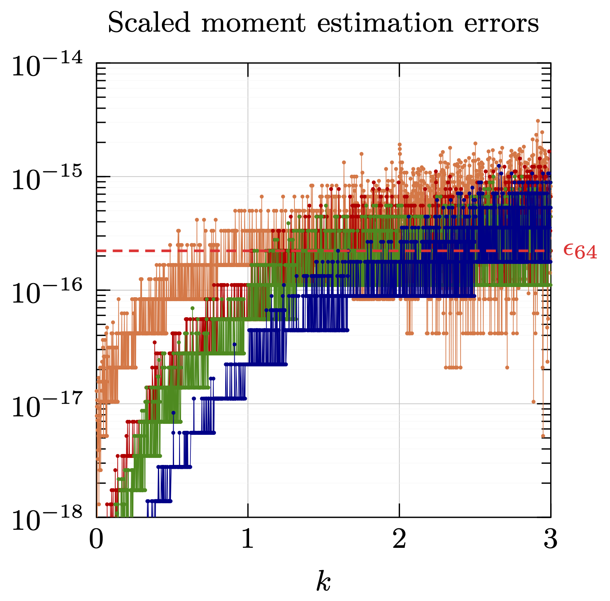
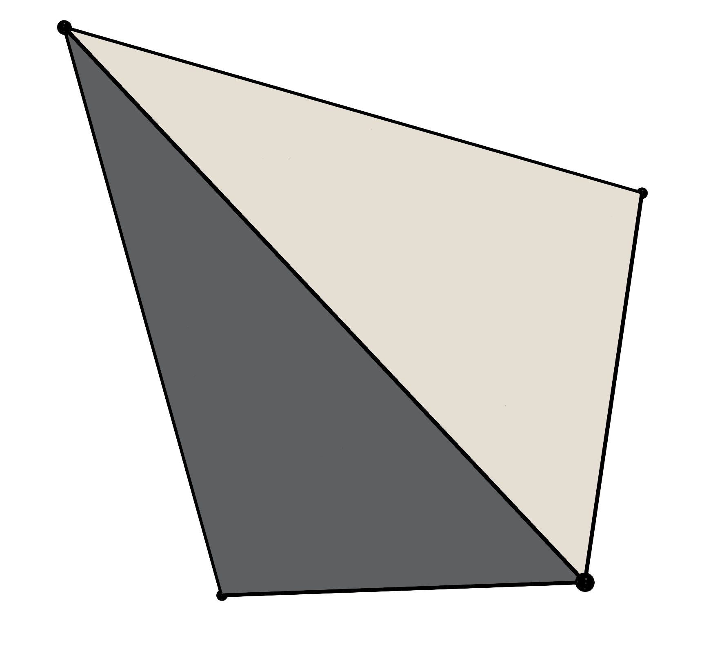
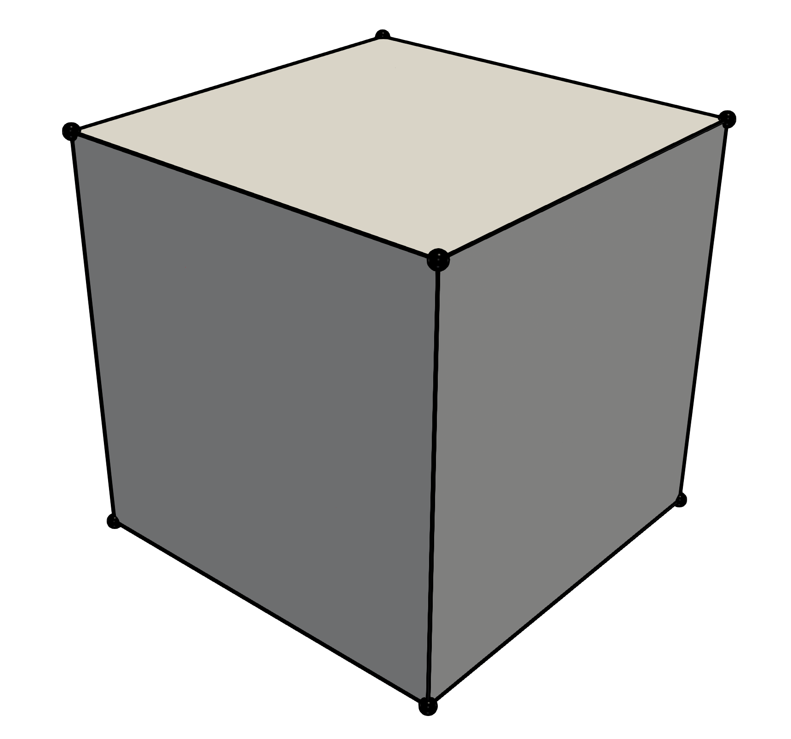
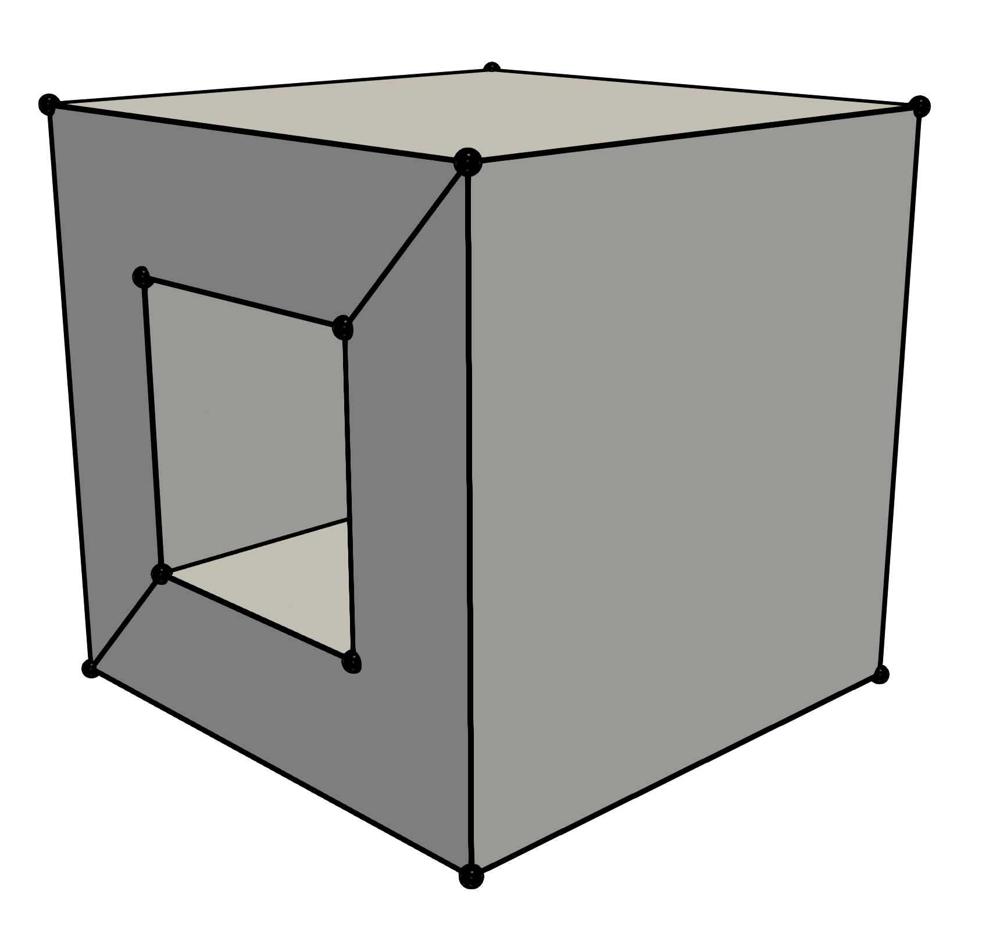
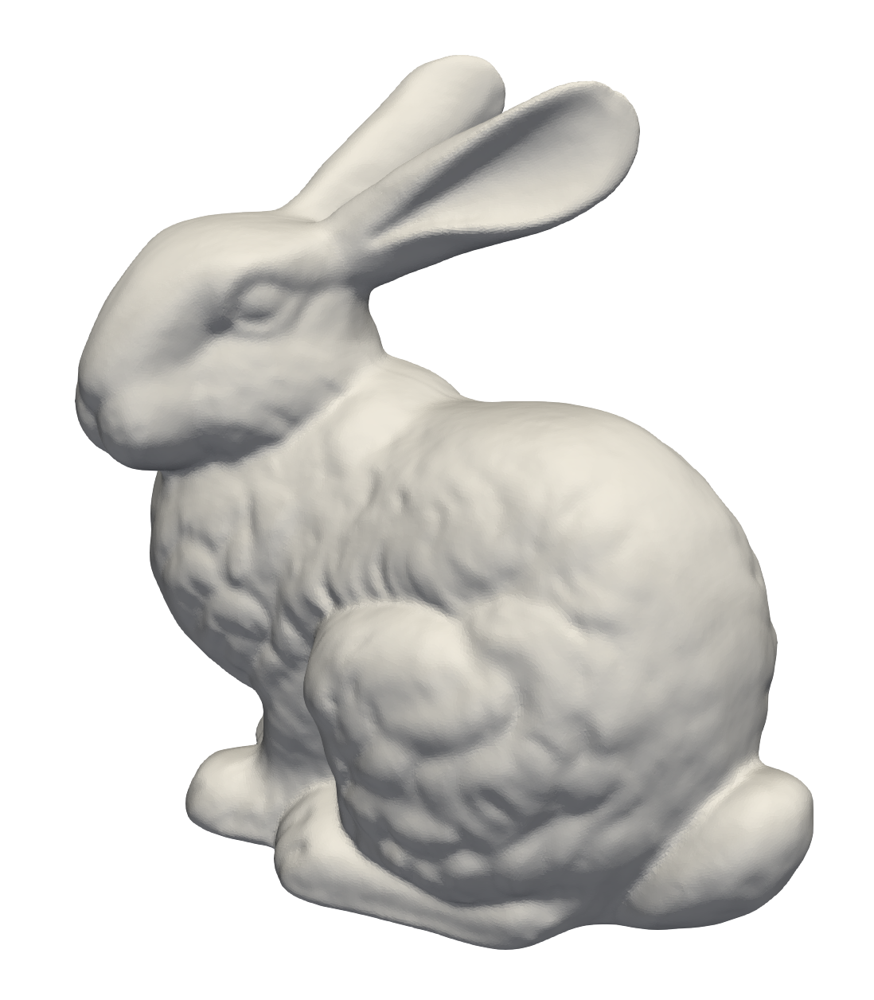

# Reproducing published results on paraboloid-polytope intersection

This document explains how to reproduce the results presented in our journal paper on paraboloid-polytope intersection, published in the SIAM Journal on Scientific Computing [[link](https://www.siam.org/publications/journals/siam-journal-on-scientific-computing-sisc)]. 

A preprint of this article is available in [arXiv](https://arxiv.org/pdf/2210.07772.pdf) as well as in the [current repository](manuscript_paraboloid_intersection.pdf).

## Unit cube translation (Section 7.1)

In order to reproduce Figures 5 and 6 of the [paper](), it is necessary to build the unit tests of IRL (for which the option `-D BUILD_TESTING=ON` must be provided when building IRL itself). This requires executing the additional command:

```
make irl_test
```

Once the unit tests have been built, the paraboloid-polyhedron intersections shown in Figure 5 of the [paper]() can be generated by executing:

```
./tests/bin/irl_test --gtest_filter=ParaboloidIntersection.SISCPaperFig5
```

This will generate a set of STL files which can be viewed with most visualization softwares (e.g., [Paraview](https://www.paraview.org/)). The files used to generate Figure 5 of  the [paper]() are:
```
surface_*.stl
unclipped_cube_*.stl
```
resulting in the following visualizations:
||||
|:---:|:---:|:---:|
|Fig. 5a|Fig. 5b|Fig. 5c|

The exact moments and estimation errors plotted in Figure 6 of the [paper]() can be generated by executing:
```
./tests/bin/irl_test --gtest_filter=ParaboloidIntersection.SISCPaperFig6
```

This produces a text file named `fig6.txt` containing the raw data (i.e., the *unscaled* moments and associated estimation errors) used for generating the plots in Figure 6, shown here:

|||
|:---:|:---:|
|Fig. 6: Exact moments|Fig. 6: Errors|

## Parameter sweep study (Section 7.2)

The moment estimation errors and execution times resulting from the graded and random parameter sweeps of Section 7.2, presented in Tables 2, 3, 4, and 6, have been generated using our [testing suite](https://github.com/fabienevrard/irl-paraboloid-testing).

This project can be cloned and built using:
```
git clone https://github.com/fabienevrard/irl-paraboloid-testing.git
cd irl-paraboloid-testing
cd external
git clone https://github.com/nlohmann/json.git
cd ..
mkdir build
cd build
cmake -DIRL_ROOT_LOCATION=<path_to_IRL_project_directory> -DIRL_INSTALL_LOCATION=<path_to_IRL_install_directory> -DEIGEN_DIR=<path_to_eigen_directory> ..
make
```
This will generate two executables named `amr_generate_result` and `irl_confirm_result`. 

As the name indicates, `amr_generate_result` produces reference results for our parameter sweeps using AMR (adaptive mesh-refinement) of the clipped polyhedron's faces. It takes an input file in the JSON format, which read as:
```
{
  "test_name": "parameter_sweep",                       <- type of test: "parameter_sweep", or "translating_cube"
  "out_file_name": "sweep_cube.bin",                    <- name of the output
  "Sweep": {                                            <- options of the parameter sweep
    "geometry": "cube",                                 <- polyhedron geometry: "tet", "cube", "dodecahedron", "cube_hole", "bunny" (cf. Table 1)
    "random": false,                                    <- are the parameters randomly sampled?
    "fix_to_paraboloid": false,                         <- do we want a vertex of the polyhedron to lie exactly on the paraboloid? (cf. Table 4)
    "translation": [[-0.5,-0.5,-0.5],[0.5,0.5,0.5]],    <- parameter space for the translation of the ref. frame
    "rotation": [ [0.0,0.0,0.0],[3.14,3.14,3.14]],      <- parameter space for the rotation of the ref. frame
    "coefficient": [[-5.0,-5.0],[5.0,5.0]],             <- parameter space for the coefficients of the paraboloid
    "translation_steps": [5,5,5],                       <- only for graded parameter sweep: number of translation steps
    "rotation_steps": [5,5,5],                          <- only for graded parameter sweep: number of rotation steps
    "coefficient_steps": [11,11,                        <- only for graded parameter sweep: number of coefficient steps
    "number_of_tests": 5e7,                             <- only for random parameter sweep: number of random samples
  }
}
```
The shapes available for testing are those introduced in Table 1 of the manuscript: 
| `tet` | `cube` | `dodecahedron` | `cube_hole` | `bunny` |
|:---:|:---:|:---:|:---:|:---:|
||||||

The input files used for producing the reference results used in Section 7.2 are given in the folder `example_inputs`. For instance,
```
mpirun -np 4 ./amr_generate_result ../example_inputs/input_random_cube.json
``` 
will use 4 CPU-cores to generate the reference results of the random parameter sweep for the cube. These calculation are expensive, so we recommend to first test them for a limited number of cases, e.g., with `"number_of_tests": 1e2`.

Once reference results have been produced and stored, our algorithm for calculating the first moments of a polyhedron-paraboloid intersection can be tested using the executable `irl_confirm_result`. For instance,
```
./irl_confirm_result random_cube_results.txt random_cube.bin
``` 
will test IRL against the results of the random parameter sweep of the cube, and summarize them in the output file `random_cube_results.txt`. This file lists information in the following format:
```
<Input AMR file> <Number of tests> <Avg. M0 error> <RMS M0 error> <Max. M0 error> <Avg. M1 error> <RMS M1 error> <Max. M1 error> <Avg. M0_surface error> <RMS M0_surface error> <Max. M0_surface error> <Avg. CPU time per moments calculation>
random_cube.bin  100               1.86E-16        2.28E-17       5.55E-16        1.46E-16        1.97E-17       3.46E-15        0.00E+00                0.00E+00               0.00E+00                2.31E-06
```

Finally, the Figures 7 and 8 of the manuscript have been generated using similar code as in the unit-test `SISCPaperFig5` introduced earlier.
